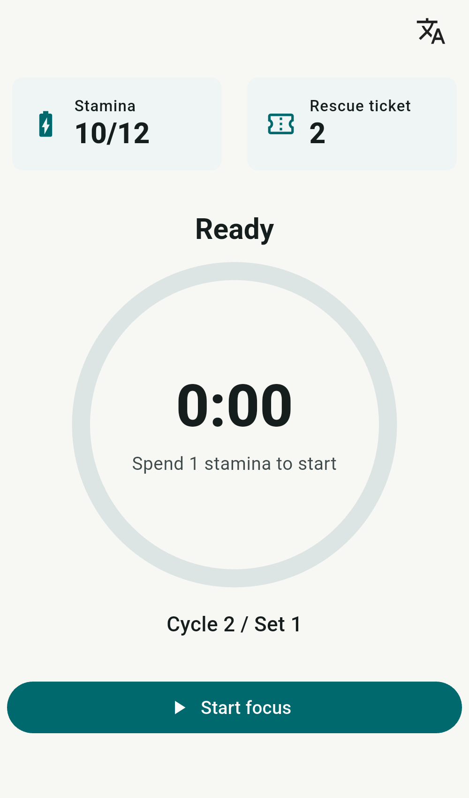
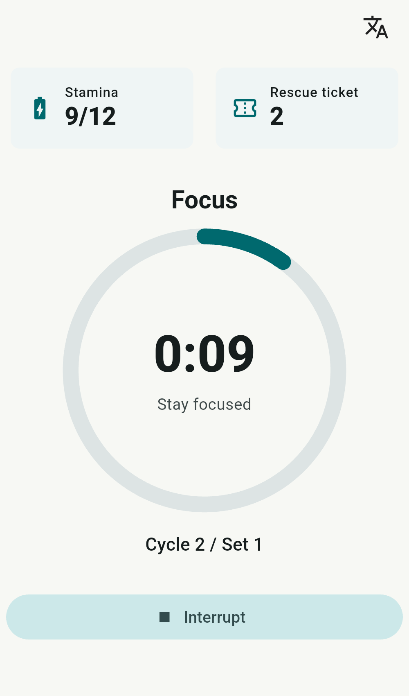
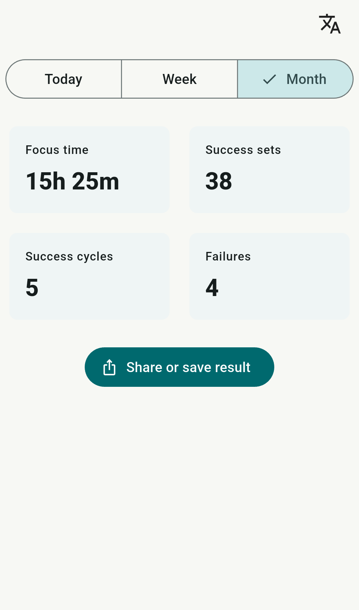
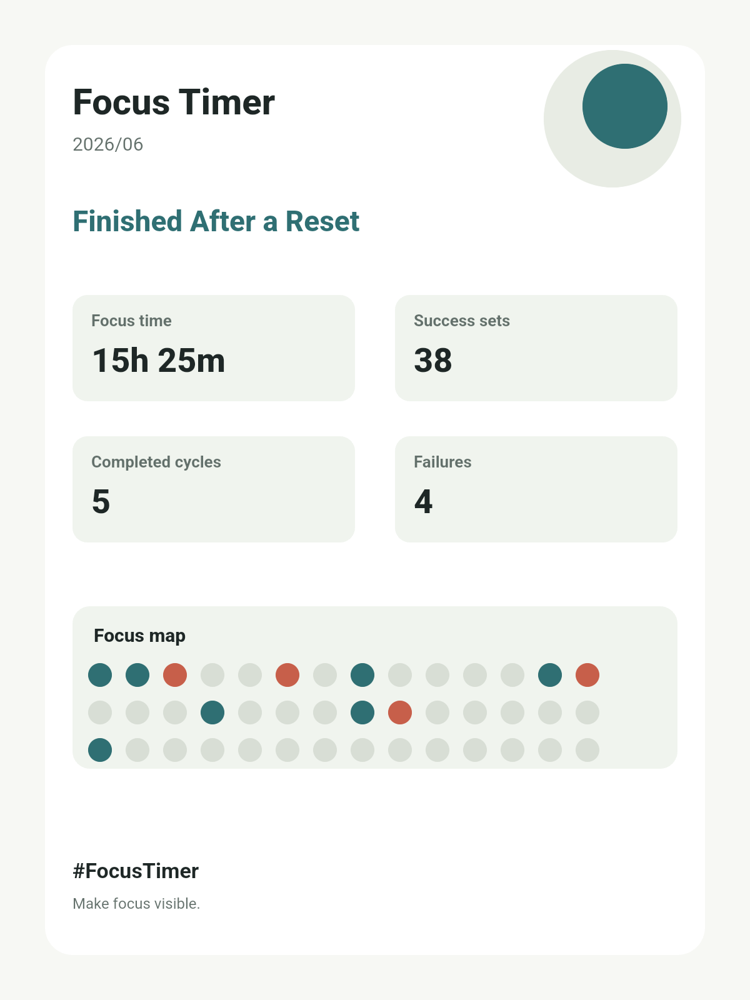
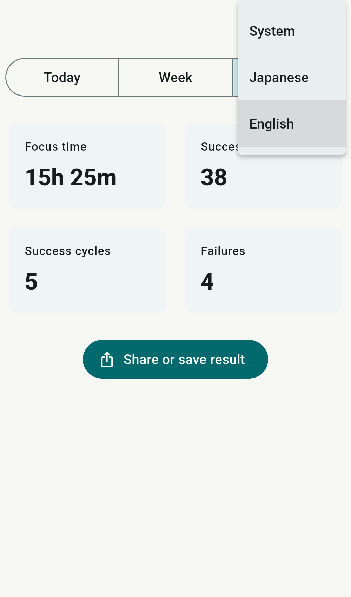

# Focus Timer

<nav class="language-switch" aria-label="Language">
  <a href="../">日本語</a>
  <strong>English</strong>
</nav>

<section class="app-hero">
  

    
A stamina-based focus timer that helps you put your phone down and stay focused.

    
Focus Timer is an Android app for building a steady rhythm of focused work and breaks. It helps reduce the moments when you reach for your phone, while keeping your focus time visible as a simple log.

  

  <figure class="app-shot app-shot--phone">
    
  </figure>
</section>

<section class="app-section">
  

    <h2>A timer for leaving your phone alone</h2>
    
Focus sessions are designed around placing your phone down.

    
If you leave the screen, pick up the device, or tilt it significantly, the app may treat that as an interruption. The goal is not to lock you in, but to make it easier to keep the time you decided not to touch your phone.

  

  <figure class="app-shot app-shot--phone">
    
  </figure>
</section>

<section class="app-section">
  

    <h2>Visualize your focus history</h2>
    
You can review focus time, successful sets, completed cycles, and failure counts by day, week, and month.

    
Both successful days and interrupted days remain visible, making it easier to look back on your personal focus rhythm.

  

  <figure class="app-shot app-shot--wide">
    
  </figure>
</section>

<section class="app-section app-section--reverse">
  

    <h2>Save and share your progress</h2>
    
From the log screen, you can generate a 3:4 image from your focus results.

    
The image summarizes focus time, successful sets, completed cycles, failures, and your focus map, then opens the Android share sheet so you can save or share it.

  

  <figure class="app-shot app-shot--share">
    
  </figure>
</section>

<section class="app-section app-section--reverse">
  

    <h2>Language support</h2>
    
You can switch the app language from the in-app language menu.

    
The public support pages are also available in both Japanese and English.

  

  <figure class="app-shot app-shot--wide">
    
  </figure>
</section>

<section class="app-info-grid">
  

    <h2>Main Features</h2>
    <ul>
      <li>Focus timer with focus and break sessions</li>
      <li>Long break after completing 4 sets</li>
      <li>Stamina-based focus start management</li>
      <li>Recovery tickets for resuming interrupted sessions</li>
      <li>Stamina recovery and rescue recovery through rewarded ads</li>
      <li>Detection for picking up, tilting, or leaving the screen</li>
      <li>Daily, weekly, and monthly focus logs</li>
      <li>Share image generation from logs</li>
      <li>Local notifications when breaks and long breaks finish</li>
    </ul>
  

  

    <h2>Privacy</h2>
    
Focus logs, stamina, tickets, and failure history are stored on your device. The app itself does not send this information to the developer's server.

    
For details, see the <a href="privacy-policy.html">Privacy Policy</a>.

  

</section>

<section class="app-links">
  <h2>Related Pages</h2>
  

    <a href="help.html">Help</a>
    <a href="contact.html">Contact</a>
    <a href="privacy-policy.html">Privacy Policy</a>
  

</section>
