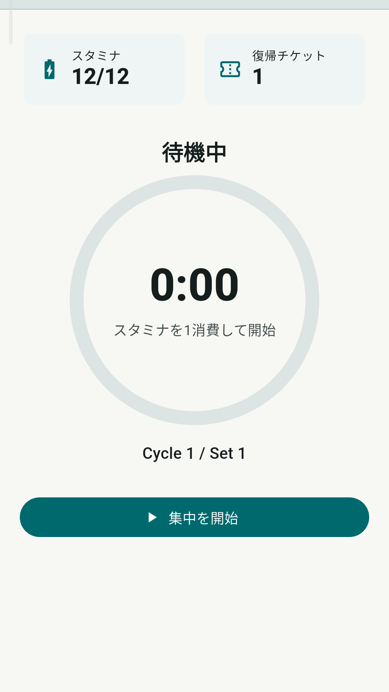
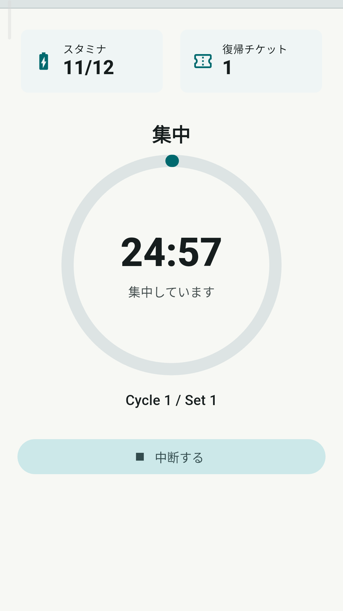
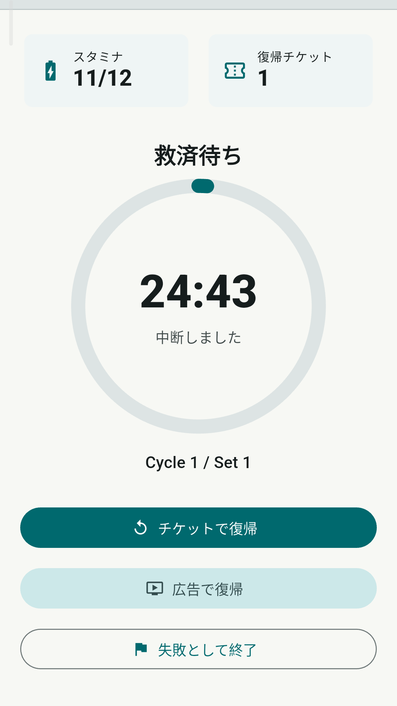
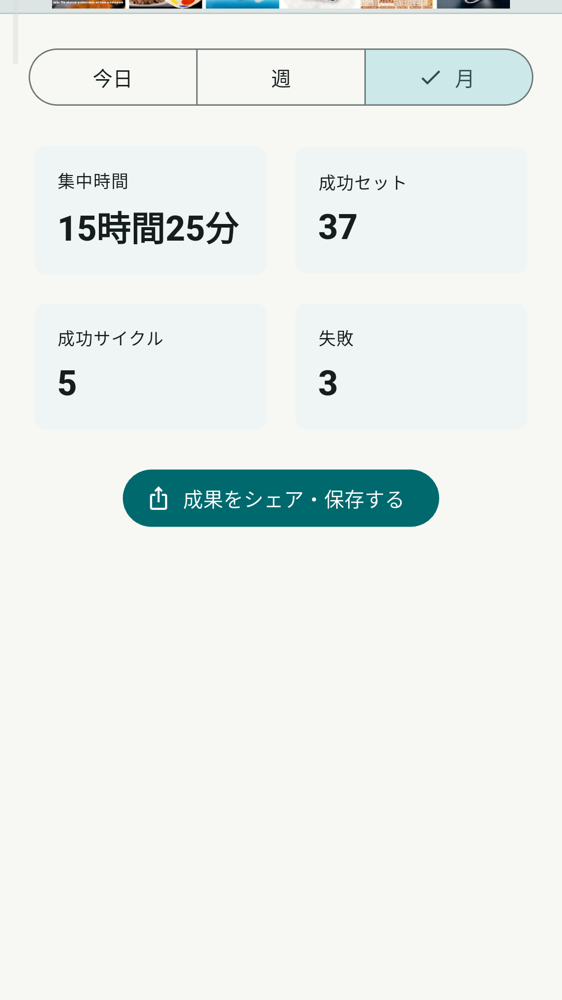
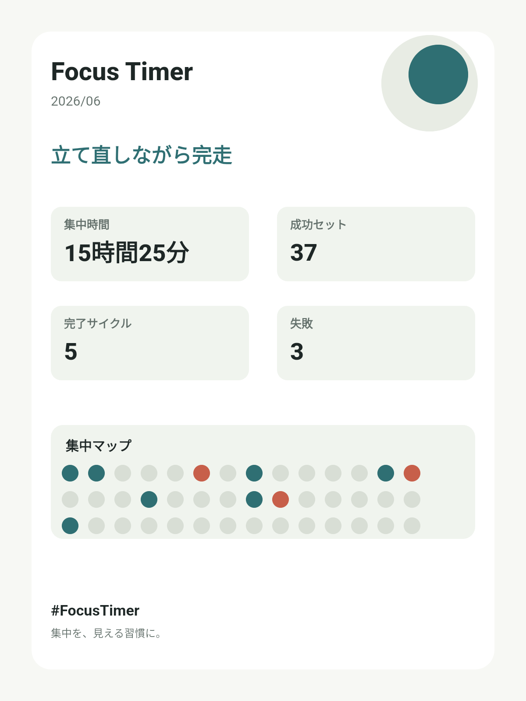
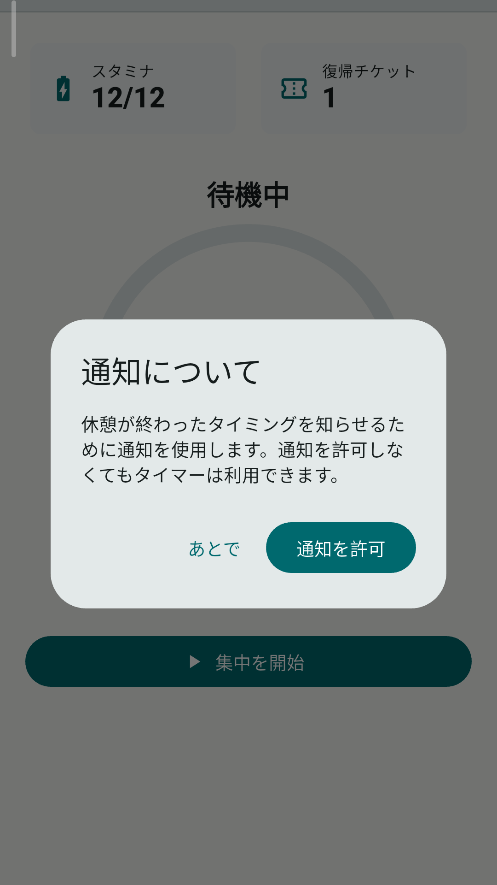

# Focus Timer

<section class="app-hero">
  

    
スマホを置いて集中するための、スタミナ制フォーカスタイマーです。

    
Focus Timerは、25分の集中と休憩を1セットとして、勉強や作業のリズムを作るAndroidアプリです。スマートフォンに手を伸ばしやすい時間を減らし、集中した時間をログとして見える形に残します。

  

  <figure class="app-shot app-shot--phone">
    
  </figure>
</section>

<section class="app-section">
  

    <h2>スマホを置くためのタイマー</h2>
    
集中中は、スマホを置いておくことを前提にしています。

    
画面を離れたり、端末を持ち上げたり、傾けたりした場合は中断として扱います。強制的に縛るためではなく、「いまは触らない」と決めた時間を守りやすくするための仕組みです。

  

  <figure class="app-shot app-shot--phone">
    
  </figure>
</section>

<section class="app-section app-section--reverse">
  

    <h2>続けやすくするスタミナとチケット</h2>
    
集中を始めるとスタミナを消費します。スタミナは時間経過やサイクル完了で回復します。

    
途中で中断してしまった場合でも、復帰チケットを使えば残り時間から再開できます。失敗をすぐ終わりにせず、立て直す余地を残す設計です。

  

  <figure class="app-shot app-shot--phone">
    
  </figure>
</section>

<section class="app-section">
  

    <h2>集中ログで積み重ねを見える化</h2>
    
今日、週、月ごとの集中時間、成功セット数、完了サイクル数、失敗回数を確認できます。

    
うまく集中できた日だけでなく、失敗した日もログに残ります。毎日の結果を見える形にすることで、自分の集中リズムを振り返りやすくなります。

  

  <figure class="app-shot app-shot--wide">
    
  </figure>
</section>

<section class="app-section app-section--reverse">
  

    <h2>成果を画像で保存・共有</h2>
    
ログ画面から、集中実績を3:4の画像として生成できます。

    
集中時間、成功セット、完了サイクル、失敗回数、集中マップをまとめた画像を、Androidの共有シートから保存・共有できます。

  

  <figure class="app-shot app-shot--share">
    
  </figure>
</section>

<section class="app-section">
  

    <h2>通知について</h2>
    
Focus Timerは、休憩完了時と長休憩完了時にローカル通知を表示できます。通知を許可しない場合でも、タイマー機能は利用できます。

  

  <figure class="app-shot app-shot--wide">
    
  </figure>
</section>

<section class="app-info-grid">
  

    <h2>主な機能</h2>
    <ul>
      <li>25分集中 + 休憩のフォーカスタイマー</li>
      <li>4セット完了後の長休憩</li>
      <li>スタミナによる集中開始管理</li>
      <li>復帰チケットによる中断からの再開</li>
      <li>広告視聴によるスタミナ回復、救済復帰</li>
      <li>端末の持ち上げ、傾き、画面離脱の検知</li>
      <li>今日、週、月の集中ログ</li>
      <li>ログからの共有画像生成</li>
      <li>休憩完了、長休憩完了のローカル通知</li>
    </ul>
  

  

    <h2>プライバシー</h2>
    
集中ログ、スタミナ、チケット、失敗履歴は端末内に保存されます。アプリ本体は、これらの情報を開発者のサーバーへ送信しません。

    
詳細は <a href="privacy-policy.html">プライバシーポリシー</a> を確認してください。

  

</section>

<section class="app-links">
  <h2>関連ページ</h2>
  

    <a href="help.html">使い方</a>
    <a href="contact.html">問い合わせ</a>
    <a href="privacy-policy.html">プライバシーポリシー</a>
  

</section>

