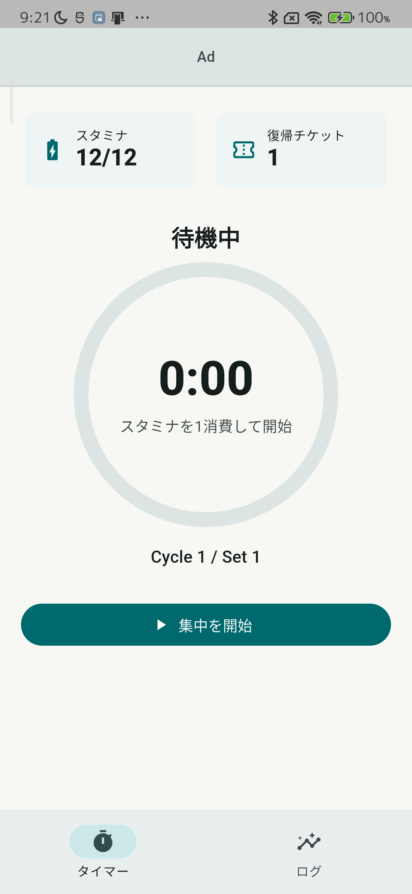
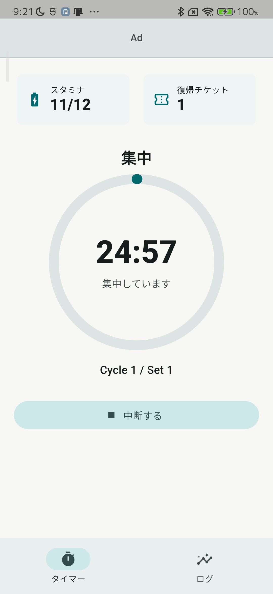
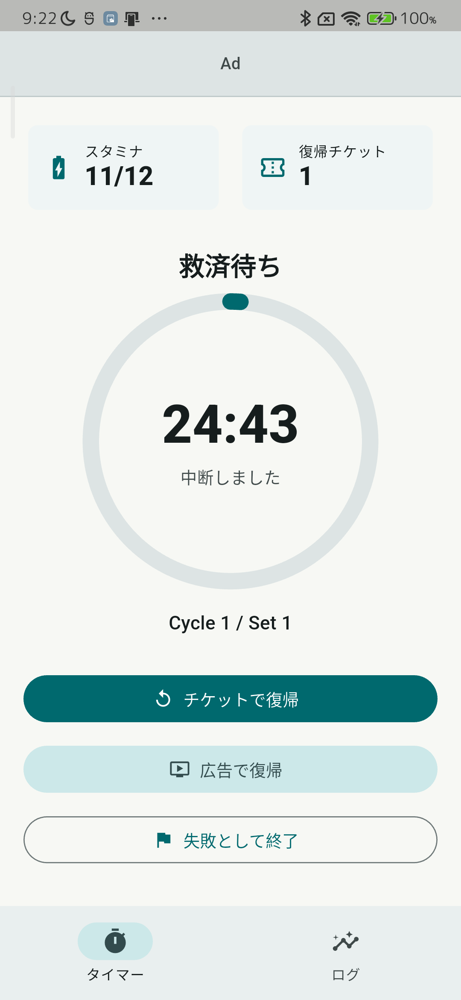
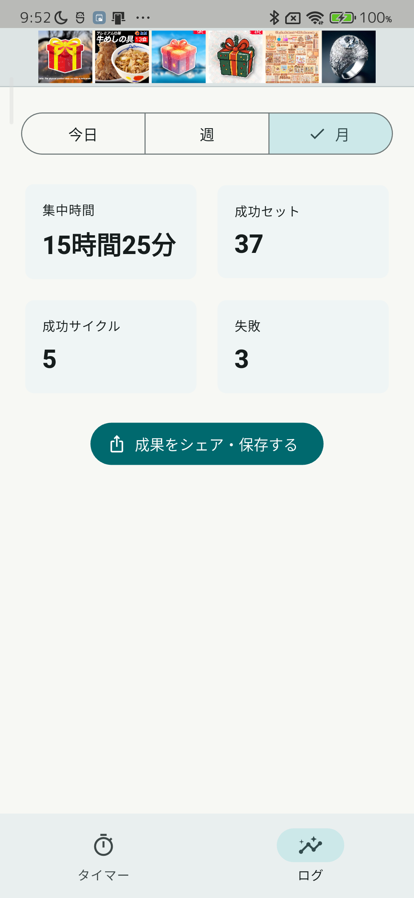
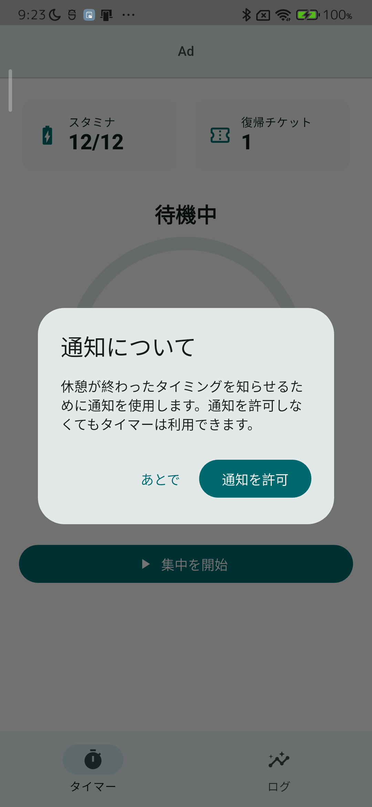

# Focus Timer

スマホを置いて集中するための、スタミナ制フォーカスタイマーです。

Focus Timerは、25分の集中と休憩を1セットとして、勉強や作業のリズムを作るAndroidアプリです。スマートフォンに手を伸ばしやすい時間を減らし、集中した時間をログとして見える形に残します。

## スマホを置くためのタイマー

集中中は、スマホを置いておくことを前提にしています。

画面を離れたり、端末を持ち上げたり、傾けたりした場合は中断として扱います。強制的に縛るためではなく、「いまは触らない」と決めた時間を守りやすくするための仕組みです。

## 続けやすくするスタミナとチケット

集中を始めるとスタミナを消費します。スタミナは時間経過やサイクル完了で回復します。

途中で中断してしまった場合でも、復帰チケットを使えば残り時間から再開できます。失敗をすぐ終わりにせず、立て直す余地を残す設計です。

## 集中ログで積み重ねを見える化

今日、週、月ごとの集中時間、成功セット数、完了サイクル数、失敗回数を確認できます。

うまく集中できた日だけでなく、失敗した日もログに残ります。毎日の結果を見える形にすることで、自分の集中リズムを振り返りやすくなります。

## 成果を画像で保存・共有

ログ画面から、集中実績を3:4の画像として生成できます。

集中時間、成功セット、完了サイクル、失敗回数、集中マップをまとめた画像を、Androidの共有シートから保存・共有できます。

## 通知について

Focus Timerは、休憩完了時と長休憩完了時にローカル通知を表示できます。通知を許可しない場合でも、タイマー機能は利用できます。

## 主な機能

- 25分集中 + 休憩のフォーカスタイマー
- 4セット完了後の長休憩
- スタミナによる集中開始管理
- 復帰チケットによる中断からの再開
- 広告視聴によるスタミナ回復、救済復帰
- 端末の持ち上げ、傾き、画面離脱の検知
- 今日、週、月の集中ログ
- ログからの共有画像生成
- 休憩完了、長休憩完了のローカル通知

## プライバシー

集中ログ、スタミナ、チケット、失敗履歴は端末内に保存されます。アプリ本体は、これらの情報を開発者のサーバーへ送信しません。

詳細は [プライバシーポリシー](privacy-policy.html) を確認してください。

## 関連ページ

- [使い方](help.html)
- [問い合わせ](contact.html)
- [プライバシーポリシー](privacy-policy.html)

